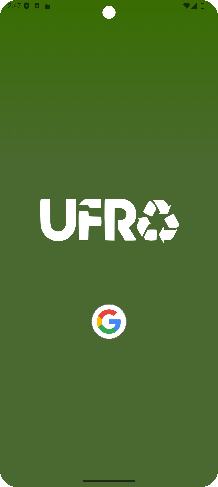
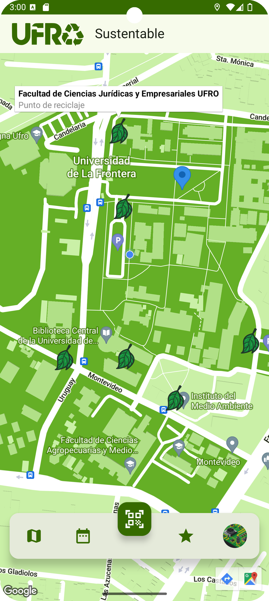
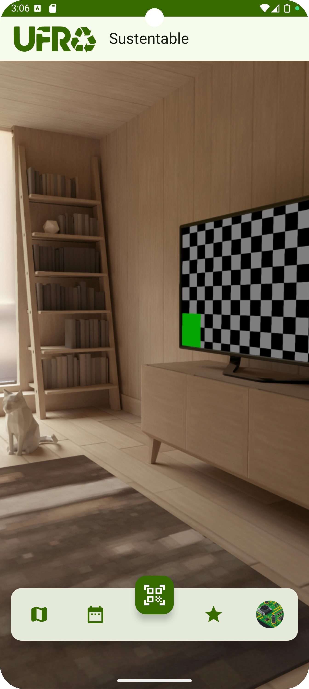
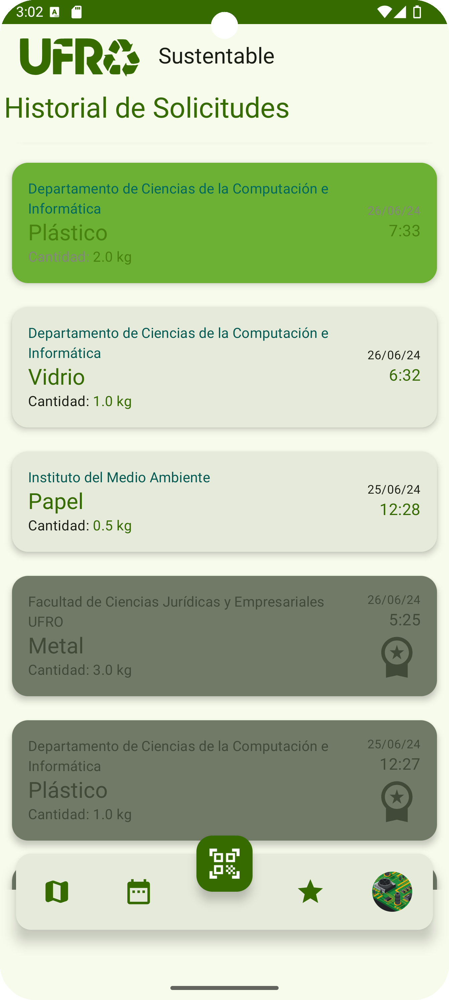
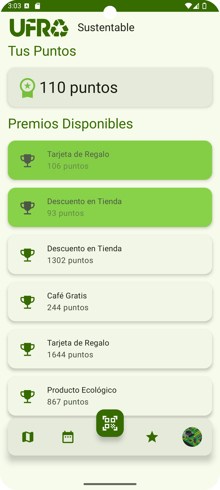
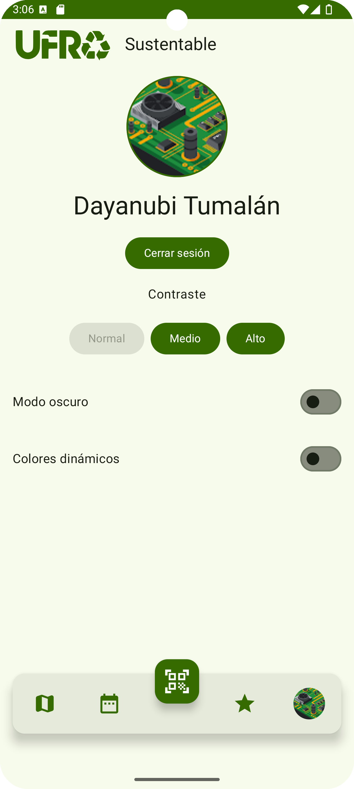

# UFRO Sustentable App

UFRO Sustentable App is a mobile application designed to promote recycling among students at the Universidad de La Frontera. The app incentivizes recycling by awarding points for recycling activities, which can be exchanged for rewards.

## Features

- **Login with Google**: Secure login using Google accounts.
- **Interactive Map**: Find the nearest recycling points on the campus.
- **QR Scanner**: Scan QR codes located at recycling points to register recycling activities.
- **Request History**: View the history of your recycling requests.
- **Rewards Section**: Exchange your accumulated points for various rewards.
- **User Profile**: Manage your profile and customize the app’s appearance, including contrast levels and system colors.

## Technologies Used

- **Kotlin Multiplatform**: For developing the app for both Android and iOS.
- **Google Maps**: To display the location of recycling points.
- **Firebase**: For authentication, data storage, and real-time database functionality.
- **Material Design 3**: To ensure a consistent and modern UI across different devices.
- **Jetpack Compose**: For building the UI in a declarative way.

## Getting Started

### Prerequisites

- Android Studio or Xcode for development.
- Google account for Firebase integration.
- Firebase project set up with authentication, Firestore, and real-time database enabled.

### Installation

1. **Clone the repository**:
   ```sh
   git clone https://github.com/Billyflin/UfroSustentableApp.git
   cd UfroSustentableApp
   ```

2. **Set up Firebase**:
   - Follow the [Firebase documentation](https://firebase.google.com/docs/android/setup) to add Firebase to your Android and iOS projects.
   - Place the `google-services.json` (for Android) and `GoogleService-Info.plist` (for iOS) files in the appropriate directories.

3. **Build and Run**:
   - Open the project in Android Studio or Xcode.
   - Sync the project to ensure all dependencies are downloaded.
   - Build and run the app on your device or emulator.

## Usage

1. **Login**:
   - Open the app and tap on the "Login with Google" button.
   - Select your Google account to log in.

2. **Finding Recycling Points**:
   - Navigate to the map screen to see nearby recycling points.
   - Tap on a point to get more details.

3. **Scanning QR Codes**:
   - Go to a recycling point and scan the QR code using the QR scanner in the app.
   - Follow the prompts to complete the recycling request.

4. **Viewing History**:
   - Navigate to the history screen to see all your past recycling activities.

5. **Exchanging Rewards**:
   - Go to the rewards section to see the available rewards.
   - Exchange your points for rewards by selecting them from the list.

6. **Managing Profile**:
   - Visit your profile to update your information and customize the app’s appearance.

## Screenshots

- **Login Screen**:
  

- **Map Screen**:
  

- **QR Scanner**:
  

- **History Screen**:
  

- **Rewards Screen**:
  

- **Profile Screen**:
  

## License

This project is licensed under the MIT License - see the [LICENSE](LICENSE) file for details.

## Acknowledgements

- Thanks to the Universidad de La Frontera for supporting this project.
- Special thanks to the development team: Victor Leñam, Claudio Sáez, and Billy Martinez.

For more details, refer to the [Software Requirements Specification](path_to_SRS_document).

# UFRO Sustentable App

UFRO Sustentable App es una aplicación móvil diseñada para promover el reciclaje entre los estudiantes de la Universidad de La Frontera. La app incentiva el reciclaje otorgando puntos por actividades de reciclaje, que pueden ser canjeados por recompensas.

## Funcionalidades

- **Inicio de sesión con Google**: Inicio de sesión seguro utilizando cuentas de Google.
- **Mapa interactivo**: Encuentra los puntos de reciclaje más cercanos en el campus.
- **Escáner QR**: Escanea códigos QR ubicados en los puntos de reciclaje para registrar actividades de reciclaje.
- **Historial de solicitudes**: Visualiza el historial de tus solicitudes de reciclaje.
- **Sección de recompensas**: Canjea tus puntos acumulados por diversas recompensas.
- **Perfil de usuario**: Gestiona tu perfil y personaliza la apariencia de la app, incluyendo niveles de contraste y colores del sistema.

## Tecnologías Utilizadas

- **Kotlin Multiplatform**: Para desarrollar la app tanto para Android como para iOS.
- **Google Maps**: Para mostrar la ubicación de los puntos de reciclaje.
- **Firebase**: Para autenticación, almacenamiento de datos y funcionalidad de base de datos en tiempo real.
- **Material Design 3**: Para asegurar una UI consistente y moderna en diferentes dispositivos.
- **Jetpack Compose**: Para construir la UI de manera declarativa.

## Comenzando

### Requisitos

- Android Studio o Xcode para el desarrollo.
- Cuenta de Google para la integración con Firebase.
- Proyecto de Firebase configurado con autenticación, Firestore y base de datos en tiempo real habilitados.

### Instalación

1. **Clonar el repositorio**:
   ```sh
   git clone https://github.com/Billyflin/UfroSustentableApp.git
   cd UfroSustentableApp
   ```

2. **Configurar Firebase**:
   - Sigue la [documentación de Firebase](https://firebase.google.com/docs/android/setup) para agregar Firebase a tus proyectos de Android y iOS.
   - Coloca los archivos `google-services.json` (para Android) y `GoogleService-Info.plist` (para iOS) en los directorios correspondientes.

3. **Construir y Ejecutar**:
   - Abre el proyecto en Android Studio o Xcode.
   - Sincroniza el proyecto para asegurar que todas las dependencias se descarguen.
   - Construye y ejecuta la app en tu dispositivo o emulador.

## Uso

1. **Inicio de sesión**:
   - Abre la app y toca el botón "Login with Google".
   - Selecciona tu cuenta de Google para iniciar sesión.

2. **Encontrar puntos de reciclaje**:
   - Navega a la pantalla del mapa para ver los puntos de reciclaje cercanos.
   - Toca un punto para obtener más detalles.

3. **Escanear códigos QR**:
   - Ve a un punto de reciclaje y escanea el código QR usando el escáner QR en la app.
   - Sigue las indicaciones para completar la solicitud de reciclaje.

4. **Ver historial**:
   - Navega a la pantalla de historial para ver todas tus actividades de reciclaje pasadas.

5. **Canjear recompensas**:
   - Ve a la sección de recompensas para ver las recompensas disponibles.
   - Canjea tus puntos por recompensas seleccionándolas de la lista.

6. **Gestionar perfil**:
   - Visita tu perfil para actualizar tu información y personalizar la apariencia de la app.

## Capturas de Pantalla

- **Pantalla de Inicio de Sesión**:
  

- **Pantalla de Mapa**:
  

- **Escáner QR**:
  

- **Pantalla de Historial**:
  

- **Pantalla de Recompensas**:
  

- **Pantalla de Perfil**:
  


## Licencia

Este proyecto está licenciado bajo la Licencia MIT - consulta el archivo [LICENSE](LICENSE) para más detalles.

## Agradecimientos

- Gracias a la Universidad de La Frontera por apoyar este proyecto.
- Agradecimientos especiales al equipo de desarrollo: Victor Leñam, Claudio Sáez y Billy Martinez.

Para más detalles, consulta la [Especificación de Requisitos del Software](path_to_SRS_document).
